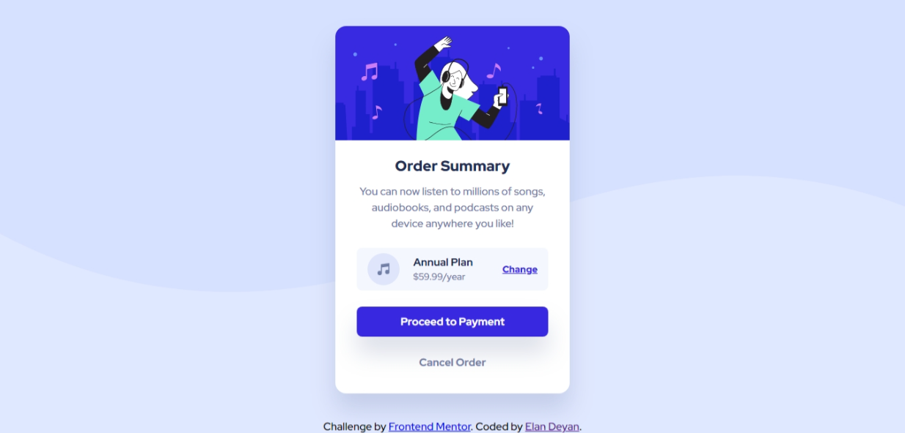

# Frontend Mentor - Order summary card solution

This is a solution to the [Order summary card challenge on Frontend Mentor](https://www.frontendmentor.io/challenges/order-summary-component-QlPmajDUj). Frontend Mentor challenges help you improve your coding skills by building realistic projects.

## Table of contents

- [Overview](#overview)
  - [The challenge](#the-challenge)
  - [Screenshot](#screenshot)
  - [Links](#links)
- [My process](#my-process)
  - [Built with](#built-with)
  - [Continued development](#continued-development)
  - [Useful resources](#useful-resources)
- [Author](#author)
- [Acknowledgments](#acknowledgments)

**Note: Delete this note and update the table of contents based on what sections you keep.**

## Overview

### The challenge

Users should be able to:

- See hover states for interactive elements

### Screenshot

### Links

- Live Site URL: [Frontend Mentor | Order summary card (elandeyan.github.io)](https://elandeyan.github.io/frontend-mentor/order-summary-component-main/)

## My process

### Built with

- CSS custom properties as variables
- Flexbox
- SCSS
- Some logical properties like "inline-size", "margin-block-end".

### Continued development

I think I need to improve the process of looking at the design and planning how to execute the design.

And the folder structure.

### Useful resources

- [Simplest CSS reset to prevent headaches](https://youtube.com/shorts/2lyDv0wOQuQ?feature=share "Youtube Shorts") - Video I used to form some _base.scss styles.
- [How to Apply CSS3 Transforms to Background Images - SitePoint](https://www.sitepoint.com/css3-transform-background-image/) - How to rotate the background-image
- [Sass: Maps (sass-lang.com)](https://sass-lang.com/documentation/values/maps) - How to use Maps in Sass
- [Stop using @import with Sass | @use and @forward explained - YouTube](https://www.youtube.com/watch?v=CR-a8upNjJ0) - Video explaining how to use @use and @forward from Sass.
- [:active - CSS: Cascading Style Sheets | MDN (mozilla.org)](https://developer.mozilla.org/en-US/docs/Web/CSS/:active)
- [Button shrink animation - 30 seconds of code](https://www.30secondsofcode.org/css/s/button-hover-shrink-animation)

## Author

- Frontend Mentor - [@ElanDeyan](https://www.frontendmentor.io/profile/ElanDeyan)

## Acknowledgments

Thanks to everyone who encouraged me to try to improve.

And the authors of the above resources.
